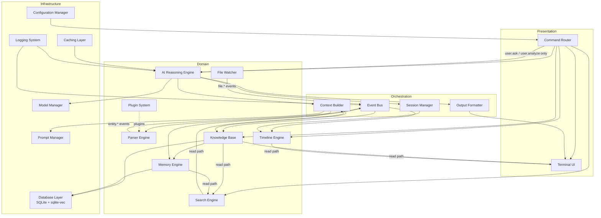

# Architecture: An AI-Augmented Terminal Workspace for Security Research

**Document type:** Software architecture specification
**Audience:** Engineers implementing the system; security leads evaluating it for adoption
**Status:** Draft v1.0

---

## 0. Reading Guide

This document follows the research brief's own topic order, offset by one section to make room for this front matter (§1 covers brief-topic 1, §2 covers brief-topic 2, and so on). Brief-topic 16, "Command Design," is deliberately pulled out of the numbered flow and delivered as **Appendix A** — the CLI surface is referenced throughout the other sections (every module exposes itself through a command), so it reads better as a single consolidated reference than as one more standalone section competing with the modules it names. Everything else keeps its natural place:

| §  | Content |
|----|---|
| 1  | Overall System Architecture |
| 2  | Terminal UX Design |
| 3  | Workspace & Project Layout |
| 4  | Event-Driven Architecture |
| 5  | File Watcher |
| 6  | Parser System |
| 7  | Knowledge Base (Knowledge Graph) |
| 8  | AI Memory |
| 9  | Preventing Hallucinations |
| 10 | Databases |
| 11 | AI Model Integration |
| 12 | Prompt Engineering |
| 13 | Timeline Engine |
| 14 | Search Engine |
| 15 | Plugin Architecture |
| 16 | Security |
| 17 | Performance |
| 18 | Future Roadmap |

Appendices A–G hold the CLI reference, schemas, risk register, testing strategy, milestones, and a consolidated technology-stack summary.

---

## Executive Summary and Non-Goals

This document specifies the architecture for a terminal-native workspace that helps a human security researcher (bug bounty hunter or assessment consultant) organize, remember, and reason about the artifacts a real engagement produces — subdomain lists, HTTP probes, crawl output, Burp/HAR exports, JavaScript, screenshots, notes — as they accumulate over days or weeks.

It is **not** an autonomous agent, and that constraint is load-bearing, not decorative. Four rules apply everywhere in this design and are treated as invariants rather than defaults that later versions might relax:

1. The AI never independently executes a security tool, runs a scan, sends a request to a target, or attempts exploitation. Every byte the AI reasons over was produced by a tool the researcher ran themselves and dropped into the workspace, or typed themselves as a note.
2. The AI activates only on one of four triggers: a new file appears, an existing file changes, the researcher explicitly asks a question, or the researcher explicitly invokes an analysis command. It is otherwise idle — no background "helpfully" re-analyzing, no proactive suggestions pushed unprompted.
3. The AI never fabricates a finding, invents a scan result it wasn't given, or asserts a vulnerability exists without evidence the researcher can inspect. Where the data doesn't support an answer, the correct output is "I do not have evidence," "I cannot determine this," or "more data is required" — not a plausible-sounding guess.
4. Every AI-generated claim is traceable to the specific stored artifact that supports it. If a claim can't be traced, it doesn't ship.

These four rules shape almost every architectural decision that follows: why the system is built around an event bus rather than an autonomous loop, why the Knowledge Base separates "observed" from "researcher-attested" data, why the AI Reasoning Engine is reachable from exactly two event types, and why an entire section (§9) is dedicated to the mechanics of grounding.

**Non-goals:** exploitation, active scanning orchestration, automatic report submission to bounty platforms, multi-tenant SaaS delivery (the MVP is a single researcher on a single machine — see §18 for how a team tier might later be added without weakening these invariants), and general-purpose chat unrelated to the active engagement.

---

## 1. Overall System Architecture

### 1.1 Module inventory

| Module | Responsibility |
|---|---|
| **Workspace Manager** | Top-level lifecycle: `init`/`open` a workspace, load `config/workspace.toml`, coordinate startup of every other module |
| **Project Manager** | CRUD over `projects/<slug>/`; archival; per-project settings that override workspace defaults |
| **Knowledge Base (KB)** | The structured store of entities and relationships (§7); source of truth for "what do we know" |
| **Memory Engine** | Derived, compressed representations of the KB for the AI — summaries and embeddings (§8) |
| **File Watcher** | Cross-platform filesystem event source; debounces and routes to parsers (§5) |
| **Timeline Engine** | Event-sourced history, snapshots, diffs (§13) |
| **AI Reasoning Engine** | The only module allowed to call an LLM; reachable solely from `user.ask`/`user.analyze` (§4, §9) |
| **Search Engine** | Hybrid keyword+semantic retrieval, reused by the TUI filter and the AI's Context Builder (§14) |
| **Parser Engine** | Format- and tool-specific extraction into KB entities (§6) |
| **Plugin System** | Independently pluggable source integrations (§15) |
| **Terminal UI** | The lazygit/k9s/btop-inspired multi-pane presentation layer (§2) |
| **Command Router** | Dispatches CLI verbs (`workspace ask`, `workspace import`, …) to the owning module (Appendix A) |
| **Configuration Manager** | Loads/validates `workspace.toml`, per-project overrides, plugin allowlist |
| **Logging System** | Structured, redacted operational logs (§16) |
| **Database Layer** | SQLite (+ sqlite-vec) access, migrations, WAL management (§10) |
| **Caching Layer** | Prompt/response cache and embedding cache (§17) |
| **Model Manager** | Local/remote model lifecycle: pulls, verifies, warms, tracks context-window limits (§11) |
| **Prompt Manager** | Loads and versions the templates in `ai/prompts/` (§12) |
| **Event Bus** | The async backbone connecting Watcher → Parser → KB → Timeline → Memory → UI (§4) |
| **Session Manager** | Tracks `ask`/`analyze` invocations as first-class, browsable entities (§7, §13) |
| **Context Builder** | Assembles a token-budgeted, cited context for each AI invocation (§8, §11, §12) |
| **Output Formatter** | Renders AI output for the TUI (with inline evidence links) vs. for `report` generation (Markdown/PDF) |

### 1.2 Why an event-bus monolith, not microservices

Three architectures were considered: (a) a single static binary organized around an in-process event bus; (b) a client/server split (a daemon plus a thin TUI client); (c) a microservice mesh (separate processes per module, communicating over gRPC/HTTP).

(c) is rejected outright: this tool runs on disposable VMs, boxes with no network egress, and client-provided machines (the same constraint that drove the Go/Bubble Tea choice in §2). A mesh of processes multiplies the deployment surface exactly where the deployment surface must be smallest, and it does nothing for a single-user tool that a mesh is designed to buy — independent scaling of load that doesn't exist here.

(b) is a legitimate variant, and this design keeps its shape available: the Event Bus and Database Layer are the seam. Running the workspace as `workspace daemon` with the TUI as a thin client that reconnects across SSH sessions is possible without changing any module's internal contract — it's how the future team-shared tier (§18) is reached. But it is not the default, because a daemon is one more thing to remember to start/stop/secure on a box the researcher doesn't fully control.

(a) is the default: one process, one binary, an in-process event bus (Go channels, per §4's pipeline), with every module above addressable as a Go interface. This gives the daemon-mode upgrade path for free later while keeping the common case — a researcher opens a terminal and runs `workspace open` — completely dependency-free.

### 1.3 Two communication paths, not one

A single event bus is not the only channel in this system, and conflating "the write path" with "the read path" is a common design mistake worth naming explicitly:

- **Write path (async, event-driven):** File Watcher → Parser Engine → Knowledge Base (diff-and-write) → Timeline Engine + Memory Engine (both subscribe to KB writes) → Terminal UI's "what changed" strip. This is the pipeline diagrammed in §4. Nothing here blocks the researcher.
- **Read path (synchronous, direct calls):** the Terminal UI's panels, the Search Engine, and the AI Reasoning Engine's Context Builder all query the Knowledge Base and Memory Engine directly through a read API — no event required, no queue, no async round-trip. Browsing already-ingested data must feel instant; routing it through the event bus would add latency for no benefit.

The only place these paths intersect is cache invalidation: an `entity.changed` event on the write side must invalidate any cached read (prompt-response cache, embedding cache) that depended on the old value — detailed in §17.

### 1.4 Component diagram

### 1.5 Layering rationale (ports and adapters)

Each Domain module is defined by an interface (a "port"); the Infrastructure modules are swappable "adapters" behind those ports. This is why §7's Knowledge Base can start on SQLite and later grow an optional graph-database adapter without touching the Parser Engine, and why §11's Model Manager can point at Ollama today and vLLM in a team deployment tomorrow without the Prompt Manager or Context Builder knowing the difference. The pattern is used deliberately, not decoratively — it is the mechanism by which "single binary today, daemon or team server tomorrow" stays true without a rewrite.

